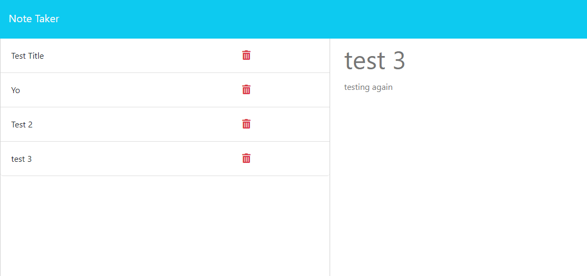

# Note Taker

#### by JJ Saoit 

## Preview

## Description

Simple note taking application that works with express routing to handle notes.

## Table of Contents

- [Installation](#installation)
- [Usage](#usage)
- [Credits](#credits)
- [License](#license)

## Installation

NPM install express and uui. After that the application should be ready

## Usage

If you want to note something down to remind yourself of it later, this is the perfect app for that.

## Credits

Name: JJ Saoit
E-mail: saoitjensen@gmail.com
Github: jensenjamessaoit
Colaborators: N/A

## License

This project is licensed under [MIT](https://opensource.org/license/mit/).
